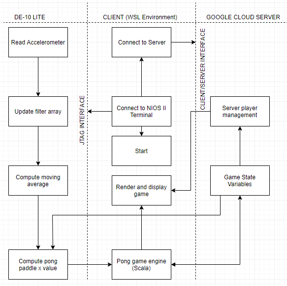
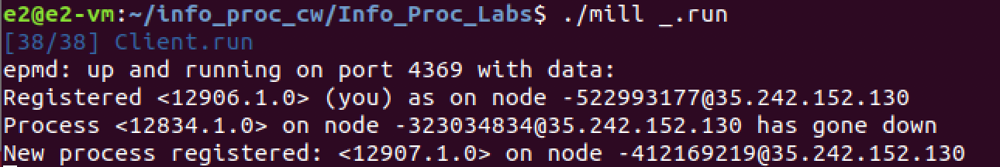
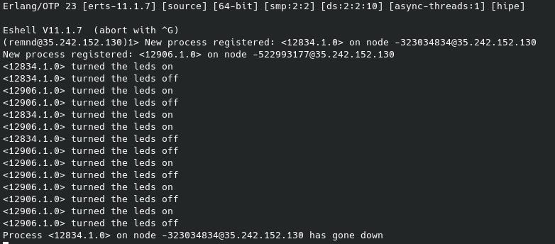

= Developing an IoT System: ELEC50009 Information Processing
:doctype: book
:author: I.Mohamed, T.Moores, A.Rehman, H.Solomon
:toc:
:toclevels: 5
:stem: asciimath
:font-size: 5
:pdf-theme: theme.yml

=== Aim
The aim of this project was to recreate the popular arcade game Pong through which users could connect to the game via their DE10 FPGA boards. The data from the Accelerometer SPI interface of each FPGA would be processed locally and used to move the player's paddle through communication with the cloud-based Game server, which would handle updates to the game state. 

=== Design
==== Functional & Non-Functional Requirements
For the system to perform as stated in the in line with system requirement, the following functional and non-functional requirements need to be met:

* Functional
** Establish connection between nodes (user FPGAs) and the cloud based server.
** Have a method of sourcing data to alter players' paddle position via the Accelerometer SPI Interface.
** Authentically recreate the game 'Pong'.
** Have means for at least 2 players to join the gain simultaneously.
* Non-functional
** Have a pleasant user interface.
** Display the score of the game via the 7-segment display
** Have minimal Latency between when the user moves their FPGA board and the paddle moves on screen.
** Have a low-maintenance and stable server application.

==== System Design & Architecture

===== Server
Erlang, a highly specialised programming language designed for building and monitoring multi-nodal networks and distributed applications, was chosen to implement the server to take full advantage of the Open Telecom Platform, which offers a stable connection between nodes of distributed systems with powerful message passing and monitoring features built in <<lyse_concurrent>>, as well as the crash tolerance and supervision system which would allow our application to automatically come back online following a crash. Whilst writing the game itself in a native language such as Rust or C++ and calling it from Erlang using ‘Native Implemented Functions’ would have provided a slight performance gain <<erl_nif>>, these performance gains did not offset the risk of crashing the entire system such that it had to be manually restarted in the event of the game crashing. 

As the server was set up as an OTP node, the clients would also need to be set up as OTP nodes to make full use of the benefits of the platform. While Erlang could have also been used to implement the client, the IO modules are not well suited for a console based game and the immutability of objects means making minor changes to the buffer would have used a larger amount of computing power than was necessary. As the Java Virtual Machine's console handling is better suited to our needs while also being an OS and system architecture independent platform such that we could run the client on both Windows and Linux, the JVM implementation of Scala was chosen to gain access to its powerful “Process” library to control nios2-terminal and its pattern matching abilities to more easily process the messages received from the server. 

===== FPGA
The C code would need to check the accelerometer value, process it, then send the resulting value to the client using the JTAG connection. It would also have to check for input from the client to update the speed of the paddle to match that of the ball, as well as updating the score on the built in 7-segment displays. +
The position of the paddle would be calculated using the angle of the accelerometer to calculate the rate of change of the paddle: a greater angle would result in faster movement up or down. These readings would then be filtered and smoothed to give the impression of real movement of a paddle. The filter was a size 128 equally weighted moving average filter with weights stem:[W_n = 1/128 forall n in [0,127\]]. After further review it was clear that this could be heavily simplified, by keeping a running average where the last value in the array is subtracted and the new value is added to an accumulator, resulting in only 2 additions per calculation rather than 128.

=== Implementation
==== Approach
The following approach was taken to implement the design:

. Create a Google Cloud Platform server which could handle connections between clients.
** Test this by having a simple UI-less program which could be interacted with by multiple users
. Create a UI on the client program which would aesthetically display the data received from the server
** Test this by capturing key-presses with an AWT Frame & sending this to the server as the paddle movements
. Create the desired filter to smooth the movement of the paddle in C.
. Alter the client to accept data from the FPGA rather than the keyboard
. Test the final design

==== User Interface & Cloud Server Implementation 
===== User Interface
As stated in the design brief, all IoT systems via the FPGA will have to receive and process accelerometer data, hence to sufficiently test and optimise the game interface whilst this code was being developed, we created a temporary method to obtain input data in the form of an AWT frame with a key monitor. Pressing the up key would move the paddle up by a given amount & the down key would move the paddle down by the same amount. After the new position of the paddle was calculated, a message was sent to the client application relaying the change in position. 

On receiving an output from the FPGA, the client would send a message to the server in the form of an Erlang tuple containing the node name of the client, which allowed the client to be uniquely identified, and the data received from the FPGA. On receiving a new game state from the server, it would update the buffer before clearing the console and printing it to the screen. This gave the illusion of the contents of the console changing. The other messages received from the server were communicated straight to the board once they had been translated into the appropriate format: a control code followed by the score or new speed of the ball.

===== Server
The game’s server is comprised of a standard Erlang application <<erl_app>>. The supervision tree comprises of 2 modules: ‘pong game’ and ‘pong server’.

* ‘Pong server’ deals with network communication with players as well as controlling the tick rate of the game, which implemented with a timer which is created on load. It receives messages from the timer and clients and acts accordingly depending in the form of the message; each message will be processed by performing an asynchronous cast to the game or, in the case of a tick from the timer, with a synchronous call to the game to get the game state which is then sent to the player, followed by a cast to update the game state. To reduce the potential for malicious attacks on the server, the origin of a tick is confirmed to be the timer as a unique reference is sent along with the tick message, and the node name of each player is known only to that player and the server.
* ‘Pong game’ is implemented with the ‘Generic Server’ behaviour, keeps track and updates track of the game state. It updates the game state by moving the ball and players then checking for goals and bounces following asynchronous casts from the Server module and sends the game state to the server following synchronous calls. When it updates the game state, it applies safeguards intended improve playability, such as not allowing the user to move out of the game buffer. The Game module also contains functions to rotate the game state such that each player is sent the game state as though they are on the left. This makes it easier to implement the client and board systems as they can always assume that any local systems only modify the state of the player on the left wall.

==== Creating the filter for the accelerometer data
As programming in C was deemed to be more convenient than highly modifying the Quartus project each time the FPGA code was modified, the design of the system in Quartus was kept relatively simple, the only notable exception when compared to the system from Lab 3 being that off chip memory was allocated to allow for a larger C program to be stored and run on the board. This is reflected in the resource usage, which was slightly decreased from that in lab 4. +
As the FPGA needed to attempt to get input from the client without knowing whether any was ready, the `O_NONBLOCK` flag was necessary when opening the read/write buffer to prevent `getc` from blocking when no data was available.

[cols=2,frame=none]
|===
a|image::images/resource_1.png[title="Lab 4 Resource Usage",width=50%,align=center,title-align=center]
a|image::images/resource_2.png[title="System Resource Usage",width=50%,align=center,title-align=center]
|===

==== Altering the Server/ UI to accommodate input data from the FPGA
The outputs to the server from the AWT and the JTAG Interface were identical, so changing the values was relatively easy. A `nios2-terminal` process was created and IO captured; the newlines were removed from the output & the resulting data was then formatted & sent to the server.

=== Testing
image::images/testflow.png[title="Testing workflow"]

==== Establishing a connection between the FPGA and the server
A script was written to connect each board to the server, as well as code for the FPGA to send a message when the push button was pressed and released. This allowed for the testing of communication between boards via the simple task of switching the LEDs of all boards on when a button was pressed on any board, then off when that button was released.

==== Using the keyboard to control paddles in the game
As the game runs remotely by design and requires inputs of paddle positions to play, keyboard inputs were used in testing as this allowed for a simple way to move the paddles by a known amount before sending them to the server. This meant that on the client side, key presses were captured and translated into changes to a “position” variable. Testing with one player, some initial bugs were caught, for example the ball going off the screen would sometimes cause an "list index out of bounds" error. Testing with multiple players then allowed the rotation of the board and the rendering of other players to be tested, with the rotation tweaked as necessary.

==== Testing the FPGA input data
Testing of the FPGA's output data initially comprised of manually observing the data in nios2-terminal. This allowed us to ensure that the values changed as intended as the ball moved before connecting the board to the server. After this was confirmed, nios2-terminal was run from the client and the data set on to the server. A minor fix was required on windows at this stage, as newlines appeared as [10,13] rather than [10], which made the paddle jump to position 13 every other tick.

==== Performance Metrics
As both the FPGAs and the server sent data at a constant rate, it was unnecessary to ascertain the exact data processing time, so long as it was ensured that the data was received at the predefined rate. Testing to ensure that this rate was as expected involved adding a variable to the client code which measured the time between the receipt of each message. For the server this was 25ms, exactly as expected, however the board appeared to run much slower than expected; ticking once every 100ms, however as this was still a consistent rate and increasing the rate decreased the stability of the system; this value was kept at 100ms.

This meant our main quantitative metric was the latency between sending a message and getting a receipt from the server or the board. To test this for the server, we tested the time taken to connect to the server, which came to 120-150ms on average, and the time taken to register as a player on the server and receive confirmation, which took around 20-30ms on average, which were both very acceptable figures. For the FPGA, the round-trip time came to consistently 100ms. As this was the same as the slower-than-expected rate at which messages were received from the board, this is likely a lower limit of the transmission rate of the board and as such the latency of the messages arriving at and being received from the board could not accurately be measured as one or both of these journeys had a disproportionate delay.

==== Optimisations
After assessing the functionality, the next stage in the testing process was to optimise user experience. The initial ball speed was set at 2 bits per 25ms (It would move 2 bits diagonally in the 256 x 256 display buffer every server tick). Upon running the game, it was found this was to fast for the game to be playable. After further testing, this value was tuned to be 2 bits per server tick. The user paddles on screen was initially set to be 10 bits long, yet after several iterations of running the game this value was again tuned to be 25 bits. The skew of the ball as it bounced off a paddle was also determined by trial and error until an acceptable value was found.

[bibliography, footer]
== References
* [[[lyse_concurrent,1]]] Fred Hebert, "The Hitchhiker's guide to concurrency", in _Learn You Some Erlang For Great Good!_ [Online]. Available at: https://learnyousomeerlang.com/the-hitchhikers-guide-to-concurrency#concepts-of-concurrency. [Accessed 29 March 2021].
* [[[erl_nif,2]]] Ericsson AB, Stockholm, Sweden. "erl_nif" in _Erlang Run-Time System Application (ERTS): Reference Manual, Version 11.2_ Available at: https://erlang.org/doc/man/erl_nif.html. [Accessed 29 March 2021].
* [[[erl_app,3]]] Ericsson AB, Stockholm, Sweden. Erlang -- Applications" in _OTP Design Principles: User's Guide, Version 11.2_. [Online]. Available at: https://erlang.org/doc/design_principles/applications.html. [Accessed 29 March 2021].
