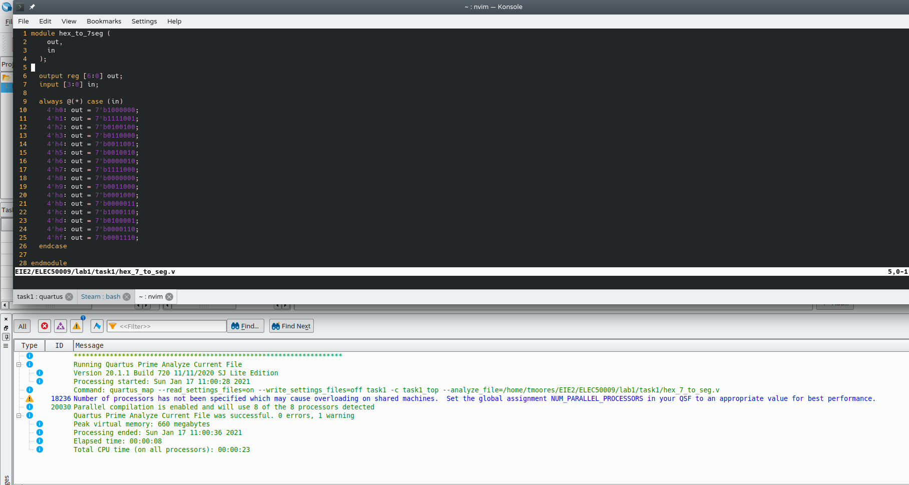

= Task 1

== Creating the project
I created a `task_1` directory and was greeted by a blank Quartus project. +
I assigned the device as a `10M50DAF484C7G` & the `Entity:Instance` tab was updated. +
The analysis of the file worked fine - the only warning came from the number of processors Quartus was using.

I wrote the top function & ran analysis and elaboration - this was successful. +
I then ran `cat pin_assignment.txt >> task1_top.qsf` to add the pin assignments to the end of the `qsf` file and began compilation. +
This completed with 185 warnings and 0 errors. It also created an `sof` file I could blast to the FPGA. +
After extensive further fiddling with JTAG and UDEV rules, I was able to flash the `sof` file to the FPGA and it correctly worked as a counter.
