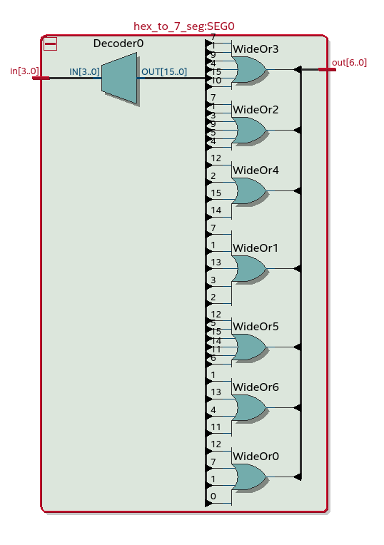
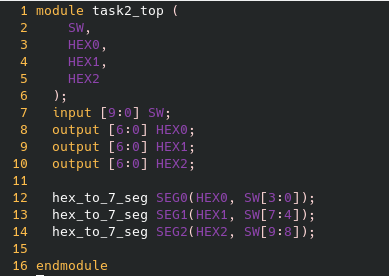

= Task 2

== Using the RTL viewer
I used the RTL viewer to obtain a graphical view of the design. The internals were essentially a series of or gates taking the input of the 4 switches and routing the output to each segment of the 7 segment display.

== Timing analysis
=== 85°C/slow
The rise-rise times ranged from 9.7ns for switch 2 to segment 1 and 8.2ns for switch 3 to segment 3. +
The rise-fall times, fall-rise times and fall-fall times correlated with this.

=== 0°C/slow
The rise-rise times ranged from 8.9ns for switch 2 to segment 1 and 7.4ns for switch 3 to segment 3. +
All times were faster than those measured at 85°C, which implies that the system is more responsive at lower temperatures.

== Using 10 switches

To enable the functionality of 10 switches, I edited the verilog as follows, which worked sucessfully.

