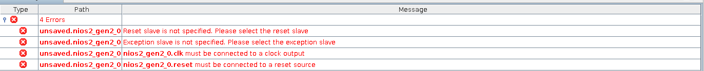
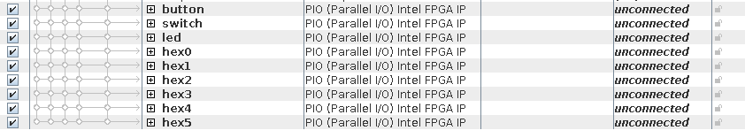

= Task 1

== Adding the CPU
I launched the 'platform designer' (rebranded version of Qsys) from the tools menu; the interface seemed identical. +
I added the Nios II processor and got the following errors:

== Adding the memory
I added the memory, changing the size to 64kiB and setting it not to initialise on programming & got similar errors as above for the memory.

== Adding the JTAG UART
I searched for the JTAG UART component, however there were none by that exact name and multiple other components it could potentially be. +
After checking the long names and finding `altera_avalon_jtag_uart` I added the component as described in the guide.

== Adding the parallel IO
I added a 4-bit parallel input for the buttons (although I could only see 2 on the board?), a 10-bit parallel input for the switches, a 10-bit parallel output for the LEDs and 6 7-bit outputs for the 7-segment displays and named them accordingly.

== Making the connections
I connected the components as in the guide and set up the inputs and outputs to be exported. (_to where_)

== Compilation

When compiling, I got 133 warnings and 0 _?!_ critical warnings, unlike what was suggested.

The following info messages were concerning & may require attention later:

[source]
Info (12250): Nios_setup_v2.button: PIO inputs are not hardwired in test bench. Undefined values will be read from PIO inputs during simulation.
Info (12250): Nios_setup_v2.jtag_uart: JTAG UART IP input clock need to be at least double (2x) the operating frequency of JTAG TCK on board
Info (12250): Nios_setup_v2.switch: PIO inputs are not hardwired in test bench. Undefined values will be read from PIO inputs during simulation.
