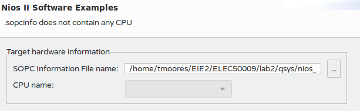

= Task 2

== Launching NIOS II SBT for Eclipse
I tried to launch NIOS II Software Build Tools for Eclipse from Quartus however nothing happened.
I then tried to determine if Eclipse was installed correctly, as I had previously installed it through XBPS. +
After finally getting Eclipse to start with the NIOS II plugins installed, I got an error stating that `the sopcinfo file does not contain any cpu`

